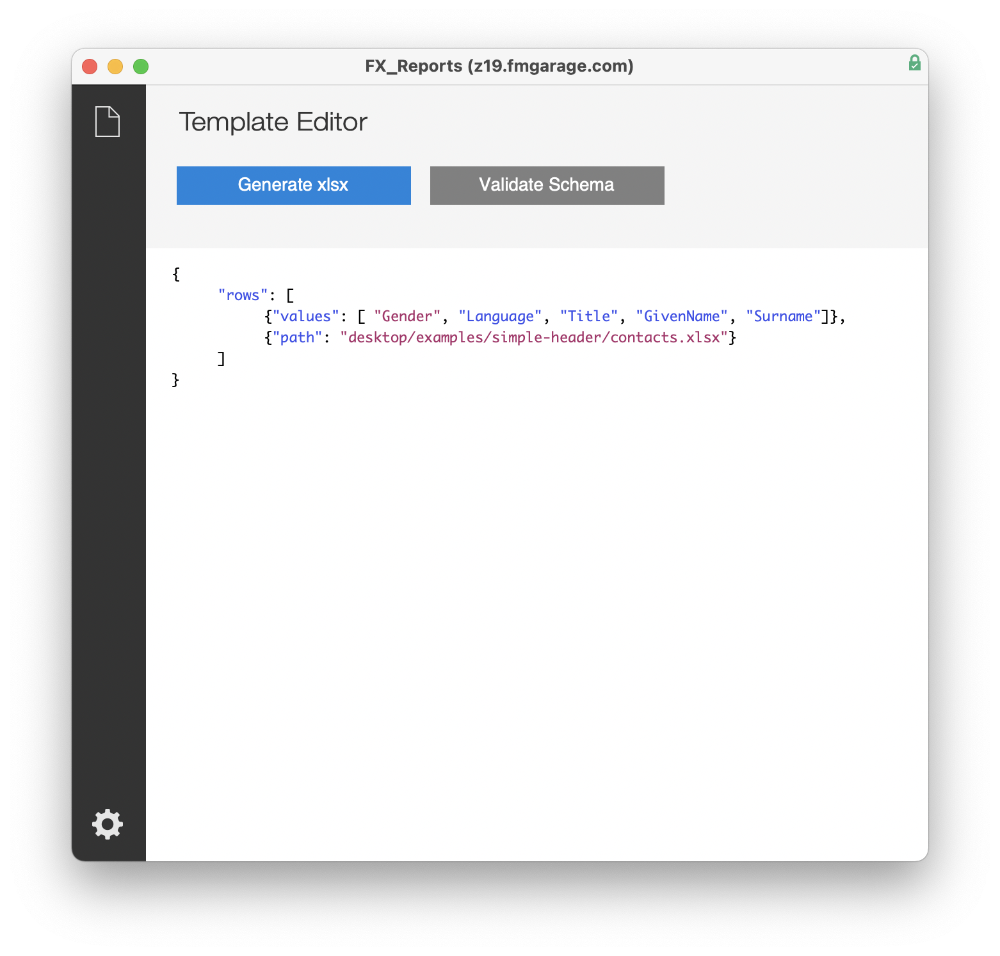

Generate fully featured Excel spreadsheets from FileMaker.

#### Downloads

- [**FX_Reports.fmp12**](https://fmgarage.com/download/fx-reports/FX_Reports.fmp12.zip) – 
- [**FX_ReportsExample.fmp12**](https://fmgarage.com/download/fx-reports/FX_ReportsExample.fmp12.zip) – example implementation in *Contacts* Starter Solution 
- [**FX_Reports Add-On**](https://fmgarage.com/download/fx-reports/FX_ReportsAddOn.zip) – FileMaker Add-on for easy implementation

#### What does 'FX' stand for? 

All our **FileMaker**-based projects and products are prefixed with an **F**, the **X** stands for **extension** or **extract**. FX files are modules that you can simply add to your own solution and they mostly contain classes and functionality taken from our **F1 Framework**.

FX modules are mostly closed source, i.e. the admin account is removed. They are free to use or have at least a free tier. Extra functionality can then be unlocked by purchasing a license.

[Browse all our FX repos](https://github.com/fmgarage?q=fx-)

**Plugins for FX Reports:**

These are needed for FX Reports to work. Choose the ones for your Operating System.

- MBS Plugin

[MBS macOS](https://fmgarage.com/download/plugins/mbs/mbs-mac.zip)

[MBS Windows 32bit](https://fmgarage.com/download/plugins/mbs/mbs-win32.zip)

[MBS Windows 64bit](https://fmgarage.com/download/plugins/mbs/mbs-win64.zip)

[MBS Linux](https://fmgarage.com/download/plugins/mbs/mbs-linux.zip)

- LibXL

[LibXL macOS](https://fmgarage.com/download/plugins/libxl/libxl-mac.zip)

[LibXL Windows 64bit](https://fmgarage.com/download/plugins/libxl/libxl-win64.zip)

[LibXL Windows 32bit](https://fmgarage.com/download/plugins/libxl/libxl-win32.zip)

[LibXL Linux](https://fmgarage.com/download/plugins/libxl/libxl-linux.zip)

### The Editor

Design templates to paste into FX Reports.

[Schema Editor](https://fmgarage.github.io/fx-reports/editor/)
