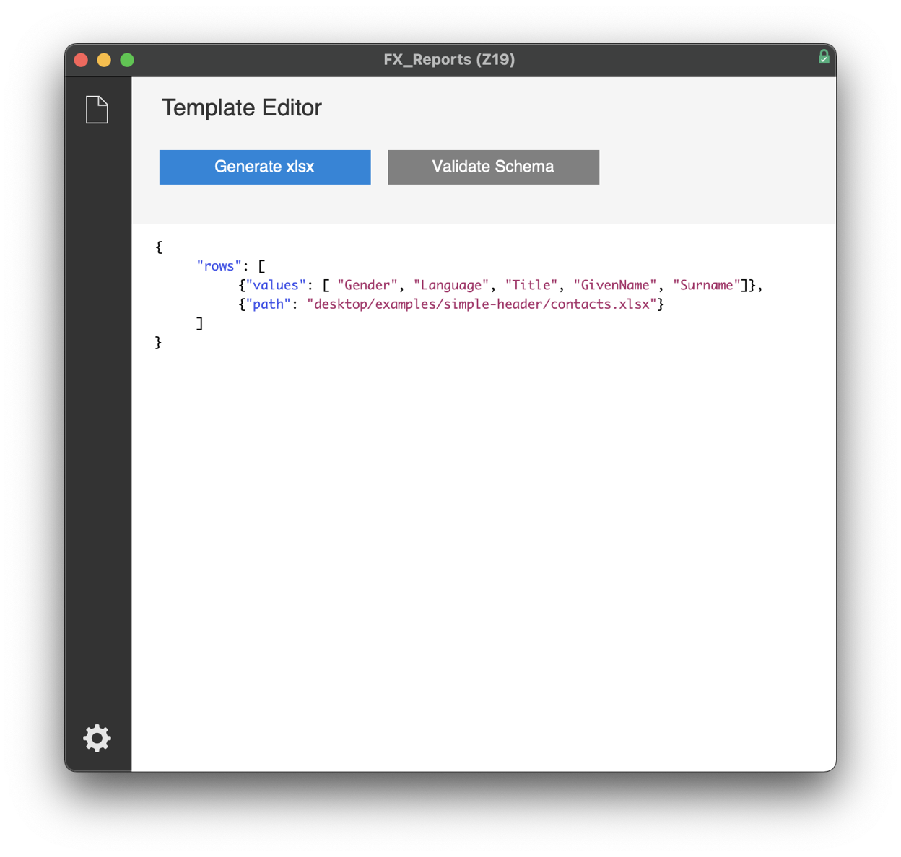
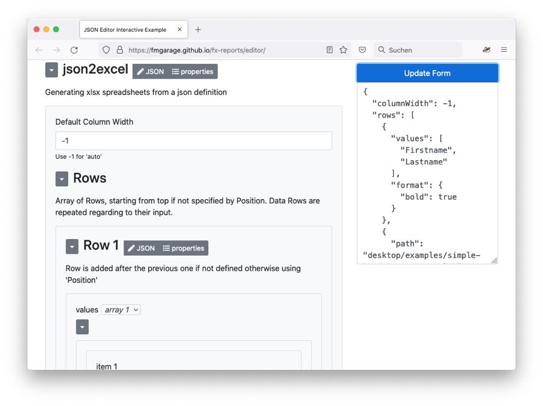

Generate fully featured Excel spreadsheets from FileMaker, dynamically defined using JSON. No scripting or programming required!

#### Downloads

- [**FX_Reports.fmp12**](https://fmgarage.com/download/fx-reports/FX_Reports.fmp12.zip)
- [**FX_ReportsExample.fmp12**](https://fmgarage.com/download/fx-reports/FX_ReportsExample.fmp12.zip) – example implementation in *Contacts* Starter Solution 
- [**FX_Reports Add-On**](https://fmgarage.com/download/fx-reports/FX_ReportsAddOn.zip) – FileMaker Add-on for easy implementation

**Required Plugins:**

FX Reports requires both the MBS plugin and LibXL being installed on your machine. You also need licenses for those but evaluation can still be done in a trial mode.

You can download the latest version from their websites:

**[MBS FileMaker Plugin](https://www.monkeybreadsoftware.com/filemaker/)**

**[LibXL](https://www.libxl.com/download.html)**

### The Editor

Create and maintain templates for using with FX Reports. If you do not want to use it online, simply download the index.html and open it locally in your browser.

[Schema Editor](https://fmgarage.github.io/fx-reports/editor/)

#### What does 'FX' stand for? 

All our **FileMaker**-based projects and products are prefixed with an **F**, the **X** stands for **extension** or **extract**. FX database files are modules that you can simply add to your own solution and they mostly contain classes and functionality taken from our **F1 Framework**.

FX modules are mostly closed source, i.e. the admin account is removed. They are free to use or have at least a free tier. Extra functionality can then be unlocked by purchasing a license.

[Browse all our FX repos](https://github.com/fmgarage?q=fx-)

