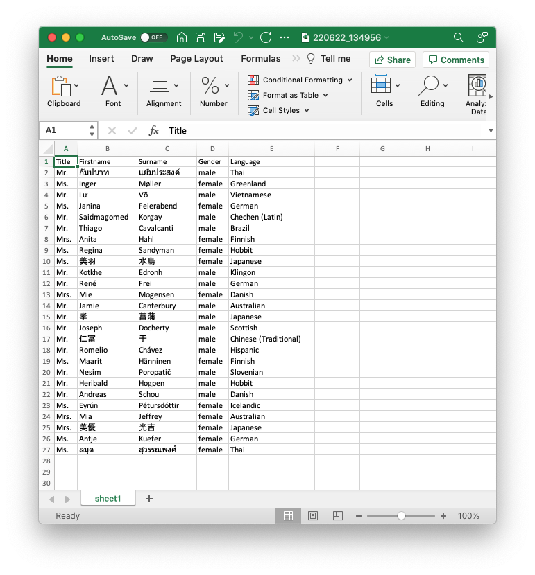

## Example: data-file

This example demonstrates how to change the header and field order from a given export.

```json
{
	"columnWidth": -1,
	"rows": [
		{"values": [ "Title", "Firstname", "Surname", "Gender", "Language"]},
		{
			"path": "desktop/examples/data-file/data-file.xlsx",
			"fields": [ "Title", "GivenName", "Surname", "Gender", "NameSet" ]
		}
	]
}
```



#### columnWidth

Adjust column width to the cells content using `-1` as value.

#### rows

An array with a header row object followed by a row object with a path property and a fields filter.

#### values

Values array for the first row. The values are written directly to the row.

#### path

File path to a source file providing data.

#### fields

Array of source field names (column headers) that result in the columns that will be taken from the source file.
