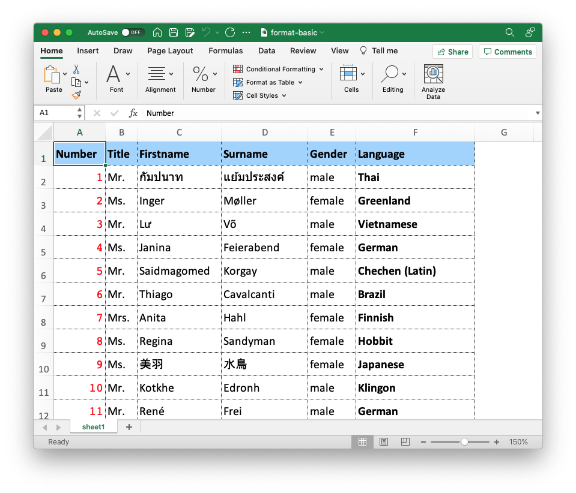

## Example: format-basic

This is a collection of different formatting options.

**Define styles:**

```json
{
	"fonts": {
		"Numbers": {
			"fontName": "Courier",
			"fontSize": 13,
			"fontColor": {"name": "Red"}
		},
		"Standard": {
			"fontName": "Calibri",
			"fontSize": 13
		},
		"Bold": {
			"fontRef": "Standard",
			"bold": true
		}
	},
	"formats": {
		"table": {
			"fontRef": "Standard",
			"alignV": 1,
			"border": 7
		}
	},
	"colors": {
		"lightblue": {"rgb": [160,210,255]}
	}
}
```


### fonts

Define Fonts that can be used in the Template. You can cross-reference to other definitions and by that extend styles. See how the `Standard` font is used in the definition of `Bold` with `fontRef`.

### formats

Define cell format options. Again, it is possible to use definitions from the other segments.

### colors

Here you can define colors.

### format

Define a set of format options for the element.

### formatRef

Define a format by referencing a preset set of options.

##### **Use defined formats and fonts**

```json
"rows": [
		{
			"path": "desktop/examples/format-basic/data-file.xlsx",
			"fields": ["Number", "Title", "GivenName", "Surname", "Gender", "NameSet"],
			"height": 26,
			"formatRef": "Table"
		}
	],
"columns": [
		{
			"dataType": "number",
			"formatRef": "Table",
			"format": {"fontRef": "Numbers"}
		},
		{
			"pos": 5,
			"formatRef": "Table",
			"format": {
				"fontRef": "Bold"
			}
		}
	]
```

##### Set format properties directly for the element.

```json
"rows": [
		{
			"values": ["Number", "Title", "Firstname", "Surname", "Gender", "Language"],
			"height": 26,
			"format": {
				"fontRef": "Bold",
				"backgroundColor": {"ref": "lightblue"},
				"alignV": 1,
				"border": "hair"
			}
		}
	]
```
