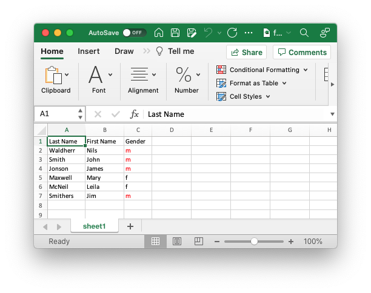

## Example: format-conditional-data-array

This example shows how to use conditional formatting on an array.

The conditions are ... in a `if...then` clause:

```json
	"columns": [
		{
			"pos": 2,
			"case": {
				"if": {
					"value": { "equalTo": "m" }
				},
				"then": {
					"formatRef": "Basic-red"
				}
			}
		}
```



### Properties

#### equalTo

- value types: string, number

Compare values. Case-insensitive when comparing strings.

```json
"value": { "equalTo": "m" }
```

#### greaterThan

- value types: number

Check if number is greater.

```json
"value": { "greaterThan": 10 }
```

#### greaterThanOrEqualTo

- value types: number

Check if number is greater or equal.

```json
"value": { "greaterThanOrEqualTo": 10 }
```

#### lessThan

- value types: number

Check if number is lower.

```json
"value": { "lessThan": 10 }
```

#### lessThanOrEqualTo

- value types: number

Check if number is lower or equal.

```json
"value": { "lessThanOrEqualTo": 10 }
```

#### beginsWith

- value types: string

Check if string has substring at the start.

```json
"value": { "beginsWith": "G" }
```

#### endsWith

- value types: string

Check if string has substring at the end.

```json
"value": { "endsWith": ")" }
```

#### contains

- value types: string

Check if string has substring anywhere.

```json
"value": { "contains": "p" }
```

#### containsAny

- value types: array of string

Check if any of multiple substrings exists in string.

```json
"value": { "containsAny": ["0","1"] }
```

#### containsAll

- value types: array of string

Check if all of multiple substrings exist in string.

```json
"value": { "containsAll": ["0","1"] }
```
