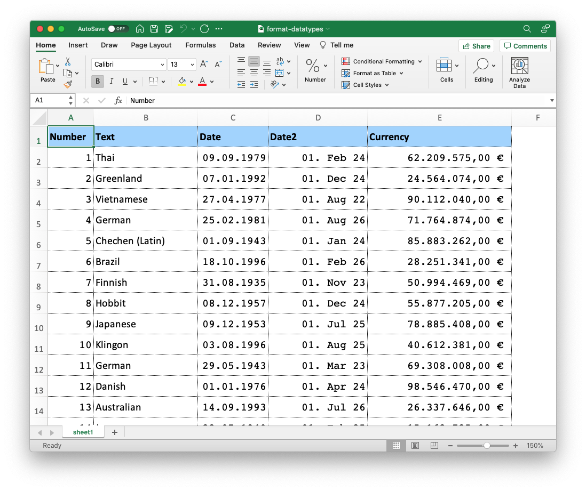

## Example: format-datatypes

This is a collection of different formatting options.

**Define styles:**

```json
{
	"fonts": {
		"Courier": {
			"fontName": "Courier",
			"fontSize": 13
		},
		"Standard": {
			"fontName": "Calibri",
			"fontSize": 13
		},
		"Standard-bold": {
			"fontRef": "Standard",
			"bold": true
		}
	},
	"formats": {
		"table": {
			"fontRef": "Standard",
			"alignV": 1,
			"border": 7
		}
	},
	"colors": {
		"lightblue": {"rgb": [160,210,255]},
		"red": {"rgb":[255,0,0]}
	}
}
```


### fonts

Define Fonts that can be used in the Template. You can cross-reference to other definitions and by that extend styles. See how the `Standard` font is used in the definition of `Standard-bold` with `fontRef`.

### formats

Define cell format options. Again, it is possible to use definitions from the other segments.

### colors

Here you can define colors.

**Use styles**

```json
	"rows": [
		{
			"values": [ "Number", "Text", "Date", "Date2", "Currency"],
			"type": "header",
			"height": 26,
			"format": {
				"fontRef": "Standard-bold",
				"pattern": 1,
				"foregroundColor": {"ref": "lightblue"},
				"alignV": 1,
				"border": 7
			}
		}
	],
	"columns": [
		{
			"type": "data",
			"dataType": "number",
			"formatRef": "table",
			"format":{
				"fontRef": "Courier",
				"numberFormat": 1
			}
		}
	]
```

### format

Define a set of format options for the element.

### formatRef

Define a format by referencing a preset set of options.

### numberFormat

Set a number format like currencies or datetimes. We will provide a compilation of the most common formats in the docs.
All formats are completely documented on [this page](https://www.mbsplugins.eu/XLFormatSetNumFormat.shtml).
