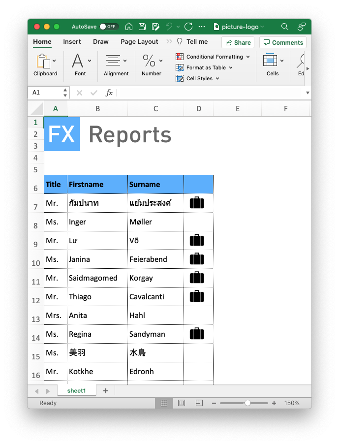

## Example: picture-logo

This example demonstrates how to place images in cells, as a logo on top or as icons in the datarows.

```json
	"cells": [
		{
			"pos": [0,0],
			"picture": {
				"ref": "logo",
				"width": 227,
				"height": 60,
				"position": "move"
			}
		}
	],
    "pictures": {
		"logo": {"path": "desktop/examples/picture-logo/fx-reports.png"},
		"suitcase": {"path": "desktop/examples/picture-logo/suitcase.png"}
	}
```


#### picture

Place an image in the cell defined in `pos`. `ref` points to the file reference.
`width` and `height` define the dimensions in pixels, can be -1 (or empty) for default size of picture.

`position` determines the future scaling and positioning behaviour of the picture.

"resize" – move and size with cells

"move" – move but don't size with cells

"fix" – don't move or size with cells

#### pictures

Set a reference for each used image and a link to the file. use the reference throughout the template to place the image.
