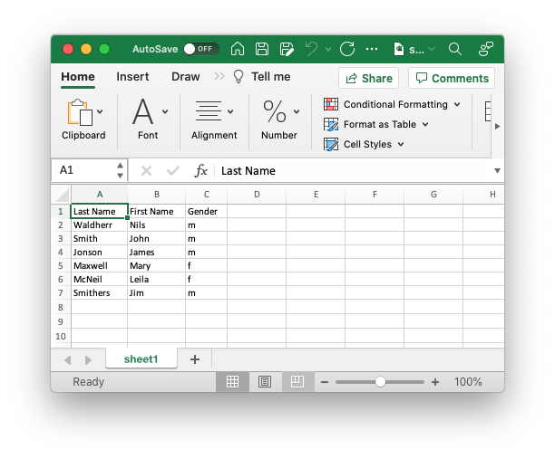

## Example: simple-data-array

This example demonstrates how to provide data rows inside the template document. You simply add arrays to the second row's value array according to the foundset of records in your application.

```json
{
	"filename": "simple-data.xlsx",
	"columnWidth": -1,
	"rows": [
		{
			"values": ["Last Name", "First Name", "Gender"]
		},
		{
			"values": [
				["Waldherr", "Nils", "m"],
				["Smith", "John", "m" ],
				["Jonson", "James", "m" ],
				["Maxwell", "Mary", "f" ],
				["McNeil", "Leila", "f" ],
				["Smithers", "Jim", "m" ]
			]
		}
	]
}
```



#### filename

Specify output file name. Otherwise *YYMMDD_hhmmss.xslx* will be used as default. 


#### columnWidth

Adjust column width to the cells' content using *-1* as value.


#### rows

Rows array.


#### values

Values array for each row.

