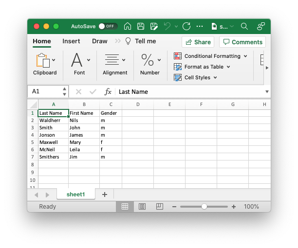

## Example: simple-data-objects

This example demonstrates how to provide data rows inside the template document. You simply add objects to the rows array according to the foundset of records in your application.

```json
{
	"filename": "simple-data-objects.xlsx",
	"columnWidth": -1,
	"rows": [{
			"values": ["Last Name", "First Name", "Gender"],
			"type": "header"
		},
		{
			"values": ["Waldherr", "Nils", "m"]
		},
		{
			"values": ["Smith", "John", "m" ]
		},
		{
			"values": ["Jonson", "James", "m" ]
		},
		{
			"values": ["Maxwell", "Mary", "f" ]
		},
		{
			"values": ["McNeil", "Leila", "f" ]
		},
		{
			"values": ["Smithers", "Jim", "m" ]
		}
	]
}
```



#### filename

Specify output file name. Otherwise *YYMMDD_hhmmss.xslx* will be used as default. 


#### columnWidth

Adjust column width to the cells' content using *-1* as value.


#### rows

Rows array.


#### values

Values array for each row.

